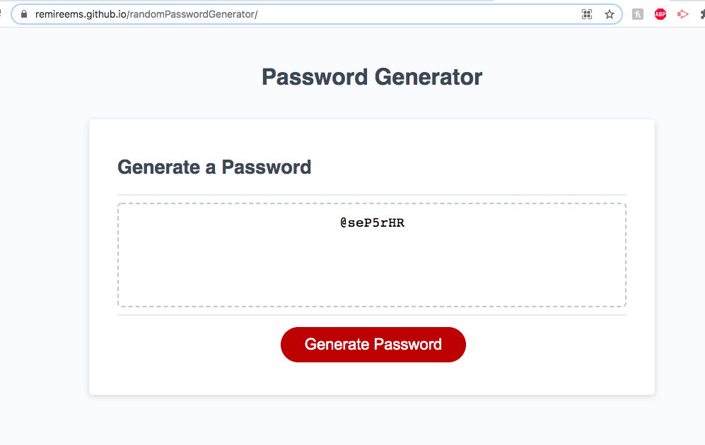

For this assignment, I have written the js code to generate a random password for the user. When the user clicks on the "Generate Password" button, it will prompt a couple of questions for them to answer. The prompts will ask which criteria the user would like to include in their password. Then, the computer will generate a random password based on the criteria the user chooses and print it out on the website.

URL: https://remireems.github.io/randomPasswordGenerator/

Screenshot:
 

